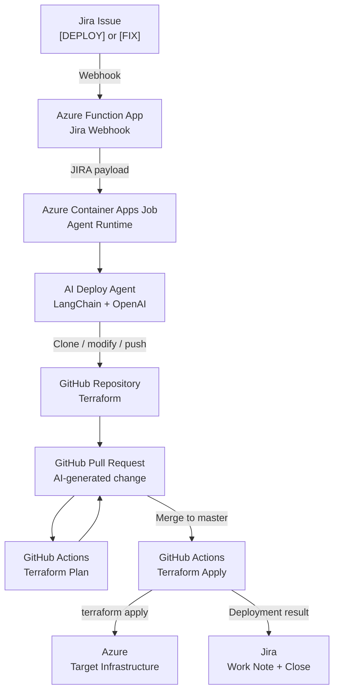

# AI-Driven Infrastructure Automation Platform

### Jira → Azure Function → Azure Container Apps Job → AI Agent → GitHub → GitHub Actions → Terraform → Azure → Jira

An AI-driven AIOps platform that transforms infrastructure requirements submitted through Jira into **version-controlled Terraform changes, pull requests, automated validation, infrastructure deployment, and Jira status updates**.

The platform combines **LLM-based agent orchestration, Infrastructure as Code, CI/CD, ITSM integration, GitHub automation, and Azure-native services** into a single infrastructure delivery workflow.

---

## Overview

The platform is designed around a simple operational workflow:

```text
Infrastructure Requirement
          │
          ▼
        Jira
          │
          │ Webhook
          ▼
   Azure Function App
          │
          │ Structured request
          ▼
 Azure Container Apps Job
          │
          ▼
     AI Deploy Agent
          │
          │ GitHub API / Git
          ▼
   Terraform Repository
          │
          │ Pull Request
          ▼
    GitHub Actions
       │         │
       │         └── Terraform Plan
       │
       └──────────── Terraform Apply
                         │
                         ▼
                       Azure
                         │
                         ▼
                  Jira Work Note
                         │
                         ▼
                   Jira → Done
```

The AI agent is responsible for understanding the infrastructure requirement and modifying the Terraform repository.

The actual infrastructure deployment is deliberately separated into the **GitHub Actions CI/CD layer**, providing a controlled boundary between AI-generated infrastructure changes and infrastructure execution.

---

# Architecture



---

# End-to-End Workflow

## 1. Requirement enters through Jira

The workflow starts with a Jira issue.

The current Function App recognizes deployment requests using the summary prefix:

```text
[DEPLOY]
```

and also recognizes:

```text
[FIX]
```

For deployment requests, the Jira webhook payload is used as the source of:

* Jira issue key
* Summary
* Description

Example:

```text
KAN-28

Summary:
[DEPLOY] Create a subnet

Description:
Create the required subnet in the existing
Terraform infrastructure.
```

---

## 2. Jira Webhook invokes Azure Function

Jira sends an HTTP `POST` webhook request to the Azure Function.

The Function App is configured with:

```text
HTTP Authentication Level: FUNCTION
```

The Function extracts the relevant issue information and determines the requested action.

The resulting payload has the following structure:

```json
{
  "ticket_id": "KAN-28",
  "summary": "[DEPLOY] Create a subnet",
  "description": "Create the required subnet in the existing Terraform infrastructure.",
  "repo_url": "<terraform-repository>",
  "action": "DEPLOY"
}
```

The Function App therefore acts as the **event-processing and integration boundary** between Jira and the AI execution environment.

---

# 3. Azure Function starts the Container Apps Job

The Function App uses Azure identity-based authentication to communicate with the Azure management API.

It:

1. Obtains an Azure access token using `DefaultAzureCredential`.
2. Retrieves the existing Azure Container Apps Job template.
3. Injects the Jira request into the container environment as `JIRA_PAYLOAD`.
4. Starts a new execution of the Container Apps Job.

Conceptually:

```text
Jira Webhook
     │
     ▼
Azure Function
     │
     ├── Extract issue
     ├── Determine action
     ├── Build JIRA_PAYLOAD
     │
     ▼
Azure Management API
     │
     ▼
Container Apps Job Execution
```

This creates an event-driven boundary between Jira and the AI runtime.

---

# 4. AI Agent receives the Jira requirement

The Container Apps Job reads the `JIRA_PAYLOAD` environment variable.

The current runtime routes requests based on the action:

```text
DEPLOY → deployment agent
FIX    → fix-agent classification
```

The deployment path is currently implemented end-to-end.

The agent runtime uses:

* Python
* LangChain
* LangChain OpenAI integration
* OpenAI
* Custom repository tools

The deployment agent is instructed to behave as a Terraform infrastructure engineer.

Its operating rules include:

* Inspect the repository before making changes.
* Understand the existing Terraform structure.
* Make only the changes required by the ticket.
* Avoid unnecessary file modifications.
* Do not modify `.git`.
* Do not directly run Git commands from the LLM tool layer.
* Do not directly run Terraform commands from the LLM tool layer.
* Use only the provided repository tools.
* Do not invent infrastructure requirements.

This creates a constrained AI execution environment around the infrastructure repository.

---

# 5. Repository is cloned

The deployment workflow creates a temporary working directory and clones the Terraform repository.

```text
Terraform Repository
        │
        ▼
Temporary Agent Workspace
```

The agent then configures Git identity and authentication.

The Git identity used by the implementation is:

```text
AI Deploy Agent
ai-infra-agent@users.noreply.github.com
```

The GitHub authentication token is supplied through runtime environment configuration.

---

# 6. AI creates a feature branch

A feature branch is created using the Jira ticket identifier.

The branch format is:

```text
feature/ai-<ticket-id>-attempt-<attempt>-<random>
```

For example:

```text
feature/ai-KAN-28-attempt-1-a1b2c3
```

This creates a direct relationship between:

```text
Jira Ticket
      │
      ▼
Git Branch
      │
      ▼
Pull Request
```

This traceability is an important part of the system design.

---

# 7. AI agent inspects and modifies Terraform

The AI agent receives the Jira requirement as its task.

It has repository-level tools for:

### File discovery

```text
list_files()
```

### File inspection

```text
read_file()
```

### Repository search

```text
search_files()
```

### File modification

```text
write_file()
```

The agent can therefore inspect the existing Terraform architecture before deciding what changes are necessary.

The AI is not provided unrestricted shell access for infrastructure modification.

Instead, the LLM operates through explicitly defined repository tools.

---

# 8. Changes are committed and pushed

After the AI finishes modifying the repository, the deployment workflow:

```text
git add .
      ↓
git commit
      ↓
git push
```

The commit message follows the pattern:

```text
<TICKET-ID>: deployment attempt <attempt>
```

Example:

```text
KAN-28: deployment attempt 1
```

This provides another layer of traceability between the Jira requirement and the infrastructure change.

---

# 9. Terraform initialization and plan

Before creating the pull request, the deployment agent configures Azure authentication and runs:

```text
terraform init
```

using the configured backend file.

It then executes:

```text
terraform plan
```

using the configured Terraform variable files.

The deployment agent therefore performs an initial infrastructure validation/planning step before creating the pull request.

The agent itself stops after the pull request is created.

```text
AI Agent
   │
   ├── Clone repository
   ├── Create branch
   ├── Modify Terraform
   ├── Commit
   ├── Push
   ├── Terraform Init
   ├── Terraform Plan
   │
   ▼
Create Pull Request
   │
   ▼
Agent execution ends
```

---

# 10. Pull Request becomes the change-control boundary

The agent creates a GitHub pull request with:

```text
Base:
master
```

The PR title follows:

```text
<TICKET-ID>: deployment
```

For example:

```text
KAN-28: deployment
```

The pull request provides a human- and GitHub-controlled boundary between:

```text
AI-generated infrastructure change
```

and:

```text
Infrastructure deployment
```

This is a deliberate design choice.

The AI agent does **not** directly execute the final infrastructure deployment.

---

# 11. GitHub Actions Terraform Plan

The Terraform repository contains a dedicated GitHub Actions workflow for Terraform planning.

The workflow can be manually triggered with a feature branch.

The workflow performs:

```text
Checkout requested branch
        ↓
Azure Login
        ↓
Terraform Setup
        ↓
Terraform Init
        ↓
Terraform Validate
        ↓
Terraform Plan
        ↓
Terraform Show - JSON
        ↓
Upload Plan Artifact
```

The generated Terraform plan is converted into JSON and uploaded as a GitHub Actions artifact.

This provides a machine-readable representation of the planned infrastructure change.

---

# 12. Pull Request merge triggers deployment

The production deployment workflow is triggered when changes are pushed to:

```text
master
```

The deployment workflow then performs:

```text
Checkout
   ↓
Azure Login
   ↓
Verify Azure Account
   ↓
Terraform Setup
   ↓
Terraform Init
   ↓
Terraform Validate
   ↓
Terraform Apply
```

The actual infrastructure deployment is therefore performed by GitHub Actions rather than by the AI agent.

---

# 13. Terraform deploys Azure infrastructure

The Terraform repository uses the AzureRM provider.

The project defines reusable modules for:

* Resource Groups
* Virtual Networks
* Subnets
* Storage Accounts
* Network Security Groups
* Network Security Group Rules

The root Terraform configuration composes these modules into the target infrastructure.

The configuration also uses variable-driven resource definitions and cross-resource references.

The architecture therefore separates:

```text
AI reasoning
```

from:

```text
Declarative infrastructure
```

and:

```text
Infrastructure execution
```

---

# 14. Jira receives the deployment result

After Terraform Apply completes, the GitHub Actions workflow extracts the Jira ticket identifier from the merged branch.

The workflow expects the Jira key to be present in the feature branch name.

For example:

```text
feature/ai-KAN-28-attempt-1-a1b2c3
```

produces:

```text
KAN-28
```

The workflow then adds a Jira work note containing deployment information, including:

* Deployment completion
* GitHub repository
* Git commit

Finally, the workflow attempts to transition the Jira issue to a completed state.

The workflow searches for a transition named:

```text
Done
```

or:

```text
Close
```

or:

```text
Closed
```

This closes the operational loop:

```text
Jira
  ↓
AI Infrastructure Change
  ↓
GitHub
  ↓
Terraform
  ↓
Azure
  ↓
Jira
```

---

# Infrastructure as Code

The Terraform implementation is maintained in a dedicated GitHub repository:

**https://github.com/SukalyanMajumdar/ai-infra-engineer/**

The repository is structured around reusable Terraform modules.

```text
modules/
├── resource_group/
├── vnet/
├── subnet/
├── storage_account/
├── nsg/
└── nsg_rule/
```

The root configuration composes these modules and uses local transformations to resolve relationships between resources.

Examples include:

```text
resource_group_key
        ↓
Resource Group
        ↓
resource_group_name
```

and:

```text
vnet_key
        ↓
Virtual Network
        ↓
virtual_network_name
```

This allows infrastructure requests to be expressed through structured Terraform variables while preserving reusable module boundaries.

---

# Terraform State

The Terraform configuration uses an Azure Storage backend:

```text
backend "azurerm" {}
```

Backend-specific values are supplied separately through backend configuration rather than hard-coded directly into the Terraform configuration.

This keeps environment-specific backend configuration outside the main infrastructure code.

---

# CI/CD Design

The repository contains two primary Terraform workflows.

## Terraform Plan

Triggered manually with a specified feature branch.

Purpose:

* Validate the proposed change.
* Generate a Terraform plan.
* Produce a JSON representation of the plan.
* Store the plan as a GitHub Actions artifact.

## Terraform Apply

Triggered by changes to:

```text
master
```

Purpose:

* Authenticate to Azure.
* Initialize Terraform.
* Validate Terraform.
* Apply the infrastructure configuration.
* Update the originating Jira ticket.

The overall model is:

```text
                 AI Agent
                    │
                    ▼
              Feature Branch
                    │
                    ▼
              Pull Request
                    │
                    ▼
             Terraform Plan
                    │
                    ▼
              Review / Merge
                    │
                    ▼
            Terraform Apply
                    │
                    ▼
                 Azure
```

---

# Security and Identity

The platform uses different authentication boundaries for different components.

## Jira → Function App

The Azure Function is configured with:

```text
FUNCTION
```

HTTP authentication.

This prevents the webhook endpoint from being an unrestricted anonymous function endpoint.

---

## Function App → Azure Container Apps

The Function App uses:

```text
DefaultAzureCredential
```

to obtain an Azure management-plane access token.

The token is requested for:

```text
https://management.azure.com/.default
```

The Function App then uses the Azure management API to retrieve and start the Container Apps Job.

---

## Agent → GitHub

The agent receives a GitHub token through environment configuration.

The token is used for:

* Git authentication
* Repository push
* Pull request creation

Credentials are not intended to be stored in the source repository.

---

## Agent → Azure

The current agent implementation uses Azure service-principal credentials supplied through environment configuration for Azure CLI authentication.

The credentials are used to:

```text
az login --service-principal
```

and then select the target subscription.

---

## GitHub Actions → Azure

The Terraform workflows use GitHub repository variables and secrets to authenticate to Azure.

Sensitive credentials are stored as GitHub Actions secrets rather than committed into Terraform configuration.

---

## GitHub Actions → Jira

The Apply workflow receives Jira credentials through GitHub Actions variables/secrets.

These credentials are used to:

* Identify the Jira issue
* Add a deployment work note
* Transition the Jira issue to a completed state

---

# Traceability

One of the central properties of the platform is traceability.

A Jira ticket identifier follows the deployment through the system:

```text
Jira Issue
    │
    │ KAN-28
    ▼
Agent Payload
    │
    │ ticket_id
    ▼
Feature Branch
    │
    │ feature/ai-KAN-28-...
    ▼
Commit
    │
    │ KAN-28: deployment attempt 1
    ▼
Pull Request
    │
    │ KAN-28: deployment
    ▼
GitHub Actions
    │
    │ Extract KAN-28
    ▼
Jira
    │
    ├── Work Note
    └── Completed Status
```

This allows the infrastructure change to remain connected to its original ITSM requirement.

---

# Failure and Fix Handling

The Jira integration currently recognizes two request categories:

```text
[DEPLOY]
[FIX]
```

The `[DEPLOY]` workflow is implemented end-to-end.

The `[FIX]` category is currently recognized by the Function App, but the agent runtime explicitly reports that the incident/fix agent has not yet been implemented.

This repository intentionally documents that implementation boundary rather than representing planned functionality as completed functionality.

Future work can extend the platform with:

```text
Deployment Failure
       ↓
Incident Diagnosis
       ↓
AI Remediation Agent
       ↓
Terraform Change
       ↓
Pull Request
       ↓
Validation
       ↓
Deployment
       ↓
Jira Update
```

---

# Current Implementation Status

## Implemented

* Jira webhook integration
* Jira issue payload extraction
* `[DEPLOY]` request routing
* `[FIX]` request classification
* Azure Function HTTP endpoint
* Azure identity-based Function-to-Azure communication
* Azure Container Apps Job execution
* Python AI agent runtime
* LangChain agent orchestration
* OpenAI model integration
* Repository inspection tools
* AI-controlled Terraform file modification
* Git branch creation
* Git commit and push
* GitHub pull request creation
* Terraform initialization
* Terraform planning
* GitHub Actions Terraform Plan workflow
* GitHub Actions Terraform Apply workflow
* Azure infrastructure deployment through Terraform
* Jira work-note integration
* Jira issue transition after deployment

## Planned Extensions

* Autonomous `[FIX]` remediation agent
* Automated deployment failure diagnosis
* Automated remediation based on Terraform failures
* Expanded infrastructure resource coverage
* Stronger policy enforcement before deployment
* Additional approval and governance controls
* Expanded observability and operational metrics

---

# Technology Stack

| Layer                         | Technology                 |
| ----------------------------- | -------------------------- |
| ITSM / Requirement Management | Jira                       |
| Event Processing              | Azure Functions            |
| AI Runtime                    | Azure Container Apps Jobs  |
| Agent Framework               | LangChain                  |
| LLM                           | OpenAI                     |
| Application Language          | Python                     |
| Source Control                | GitHub                     |
| Git Automation                | GitHub CLI / Git           |
| CI/CD                         | GitHub Actions             |
| Infrastructure as Code        | Terraform                  |
| Cloud Provider                | Microsoft Azure            |
| Containerization              | Docker                     |
| Azure Authentication          | Azure Identity / Azure CLI |

---

# Repository Structure

```text
aiops-infrastructure-automation/
│
├── README.md
│
├── architecture/
│   ├── system-architecture.png
│   ├── end-to-end-sequence.png
│   └── deployment-lifecycle.png
│
├── components/
│   ├── jira-function/
│   ├── agent-runtime/
│   ├── github-automation/
│   └── terraform/
│
├── docs/
│   ├── architecture.md
│   ├── end-to-end-flow.md
│   ├── agent-workflow.md
│   ├── github-actions.md
│   ├── jira-integration.md
│   ├── terraform.md
│   ├── security.md
│   └── implementation-inventory.md
│
├── examples/
│   ├── deploy-request.md
│   └── fix-request.md
│
└── evidence/
    ├── 01-jira-ticket.png
    ├── 02-function-trigger.png
    ├── 03-agent-execution.png
    ├── 04-github-pr.png
    ├── 05-github-actions.png
    ├── 06-terraform-plan.png
    ├── 07-terraform-apply.png
    └── 08-jira-completed.png
```

---

# Demonstration

The strongest demonstration of this project is a real end-to-end deployment.

The recommended evidence sequence is:

```text
01  Jira deployment request
        ↓
02  Function App receives webhook
        ↓
03  ACA Job / AI agent execution
        ↓
04  GitHub feature branch and Pull Request
        ↓
05  Terraform Plan workflow
        ↓
06  Terraform Plan result
        ↓
07  Terraform Apply workflow
        ↓
08  Azure infrastructure result
        ↓
09  Jira work note and completed status
```

Screenshots in the `evidence/` directory should be sanitized before publication.

Sensitive values such as credentials, tokens, subscription identifiers, tenant identifiers, internal URLs, private repository information, and personal information should be redacted.

---

# Engineering Design Principles

## AI-assisted infrastructure engineering

The LLM is used for infrastructure reasoning and repository modification rather than being granted unrestricted production deployment access.

## Git-based change control

Infrastructure changes are represented as Git commits and pull requests.

## CI/CD-controlled deployment

The final Terraform deployment is executed by GitHub Actions rather than directly by the AI agent.

## Infrastructure as Code

Azure infrastructure is represented declaratively through Terraform.

## ITSM traceability

The originating Jira ticket is carried through the workflow and used to identify the resulting Git branch, commit, pull request, and deployment record.

## Separation of concerns

The platform separates:

```text
Requirement Management
        ↓
Event Processing
        ↓
AI Reasoning
        ↓
Source Control
        ↓
CI/CD
        ↓
Infrastructure Deployment
        ↓
Operational Feedback
```

Each layer has a distinct responsibility.

---

# Why This Matters

Traditional infrastructure automation generally starts after an engineer has already translated a requirement into infrastructure code.

This platform moves the automation boundary further upstream:

```text
Natural-language requirement
            ↓
          Jira
            ↓
        AI Agent
            ↓
     Infrastructure Code
            ↓
        Pull Request
            ↓
        CI/CD Pipeline
            ↓
     Infrastructure Change
```

The result is an operational workflow that connects **ITSM, AI, source control, CI/CD, Infrastructure as Code, and cloud infrastructure**.

This is the core AIOps capability demonstrated by the project.

---

# Project Evidence

The public showcase repository contains documentation and sanitized execution evidence.

The implementation itself is distributed across the platform components, with the Terraform implementation maintained separately.

### Terraform Repository

**https://github.com/SukalyanMajumdar/ai-infra-engineer/**

---

# Project Status

**Working deployment automation:** `[DEPLOY]` end-to-end

**Infrastructure automation:** Terraform + GitHub Actions

**AI orchestration:** LangChain + OpenAI

**ITSM integration:** Jira

**Cloud execution:** Azure

**Fix automation:** `[FIX]` classification implemented; autonomous remediation is a future extension.

---

## Summary

This project demonstrates an **AI-driven AIOps infrastructure delivery platform** that connects:

> **Jira + AI Agents + GitHub + GitHub Actions + Terraform + Azure**

The system takes an infrastructure requirement from an ITSM ticket, uses an AI agent to implement the corresponding Terraform change, moves that change through Git-based review and CI/CD, deploys the infrastructure through Terraform, and records the deployment outcome back in Jira.

The architecture deliberately separates **AI-driven change generation** from **CI/CD-controlled infrastructure deployment**, providing a more traceable and governable approach to AI-assisted infrastructure engineering.

