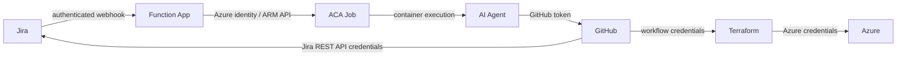

# Architecture

## Component responsibilities

### 1. Jira

Jira is the operational requirement source. The current Function App classifies requests using the beginning of the issue summary:

- `[DEPLOY]` → deployment workflow
- `[FIX]` → fix workflow classification

The current agent implementation completes the deployment path; the fix agent remains a future extension.

### 2. Azure Function App

The Function App is the integration gateway between Jira and Azure Container Apps Jobs.

Responsibilities:

- Receive the Jira webhook.
- Parse the issue payload.
- Extract ticket key, summary, description, repository URL, and action.
- Authenticate to Azure using `DefaultAzureCredential`.
- Read the ACA Job template through the Azure Resource Manager API.
- Inject `JIRA_PAYLOAD` into the first container definition.
- Start an ACA Job execution.

The HTTP trigger is configured with **Function-level authentication** in the supplied implementation.

### 3. Azure Container Apps Job

The ACA Job provides an isolated, containerized execution boundary for the deployment agent.

The job receives the Jira request through `JIRA_PAYLOAD` and starts the Python agent runtime.

### 4. Agent runtime

The deployment runtime uses:

- Python 3.14
- LangChain `create_agent`
- OpenAI `ChatOpenAI` with the Responses API
- Git
- GitHub CLI (`gh`)
- Azure CLI (`az`)
- Terraform

The container image intentionally bundles the command-line tools required to perform repository and infrastructure operations.

### 5. Agent tool layer

The LangChain agent is restricted to repository-oriented tools:

- `list_files`
- `read_file`
- `search_files`
- `write_file`

The supplied implementation also explicitly prevents writes outside the cloned repository and prevents modifications to `.git`.

The agent system prompt instructs it to inspect the repository first, make only necessary changes, avoid inventing requirements, and avoid directly executing Git/Terraform commands through the LLM tool layer.

### 6. GitHub

The runtime performs the deterministic Git operations itself:

```text
clone → configure Git → create branch → agent edits → commit → push → PR
```

The branch name contains the Jira ticket and deployment attempt:

```text
feature/ai-<TICKET>-attempt-<N>-<RANDOM_ID>
```

### 7. GitHub Actions

Two workflows are present in the Terraform repository:

- **Terraform Plan** — manually dispatched against a supplied feature branch.
- **Terraform Apply** — triggered by a push to `master`.

The Apply workflow also performs the Jira post-deployment update.

### 8. Terraform

The infrastructure repository is modular and currently contains modules for:

- Resource groups
- Virtual networks
- Subnets
- Storage accounts
- Network security groups
- NSG rules

The root module composes those modules and exposes resource IDs/endpoints as outputs.

---

## Trust boundaries



The important architectural property is that the LLM is **not** given unrestricted shell access. Repository edits are mediated through explicit tools; Git, Terraform, Azure CLI, and GitHub CLI operations are performed by deterministic application code after the agent step.
