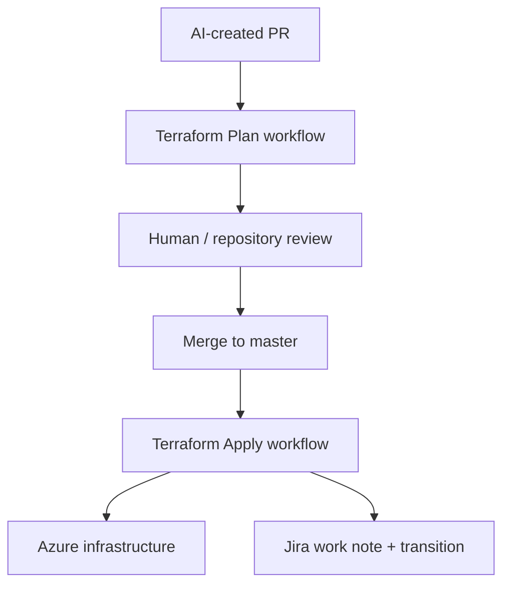

# GitHub Actions and Terraform Lifecycle

The Terraform repository contains two workflows.

## Terraform Plan

Trigger:

```yaml
workflow_dispatch
```

Input:

```text
branch: Feature branch
```

The workflow checks out the supplied branch and executes Terraform validation and planning. The resulting plan is serialized to JSON and uploaded as an artifact.

## Terraform Apply

Trigger:

```yaml
push:
  branches:
    - master
```

The workflow validates and applies the Terraform configuration using the core and environment variable files.

After apply, it derives the Jira issue key from the merged PR branch and calls Jira's REST API to:

- add a deployment work note
- transition the issue to a completed state when a suitable transition exists

## Control flow


